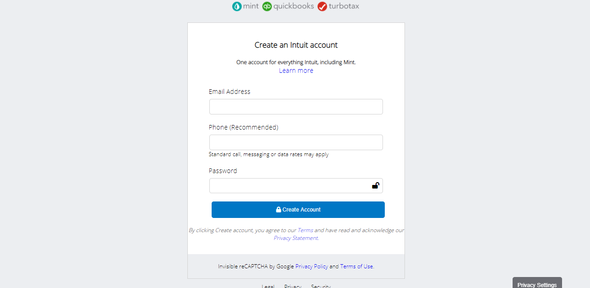

# Mint-sign-up-page-clone

> This is a clone of the sign up page found on www.mint.com

Additional description about the project and its features.

## Built With

- HTML
- CSS
- Font Awesome Icons

## Authors

👤 **Ntwali Heritier**

- Github: [@githubhandle](https://github.com/NtwaliHeritier)
- Twitter: [@twitterhandle](https://twitter.com/NtwaliHeritier)
- Linkedin: [linkedin](https://linkedin.com/in/ntwali-heritier-9950001a2)

👤 **Nick Kuria**

- Github: [@githubhandle](https://github.com/Nkuria)
- Twitter: [@twitterhandle](https://twitter.com/Nkuria3)
- Linkedin: [linkedin](https://linkedin.com/in/nick-kuria-a148931a9)

## Live Link

- https://raw.githack.com/Nkuria/Mint-sign-up-page-clone/feature-1/index.html

## Show your support

Give a ⭐️ if you like this project!

## Acknowledgments

- Hat tip to anyone whose code was used
- Inspiration
- etc

## 📝 License

This project is [MIT](lic.url) licensed.